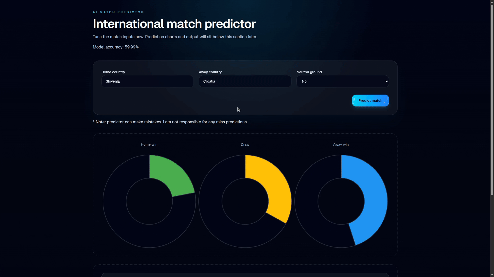

# World Cup Match Predictor

An AI-powered football match predictor that estimates the chances of a home win, draw, or away win for international matches.

**Live demo:** https://international-match-predictor.vercel.app

---

## Results

- Trained on **5,000+ historical international matches**
- Achieves **60% accuracy** on match outcome prediction (home win / draw / away win)
- Serves predictions through a FastAPI backend and displays them in an animated Next.js frontend

> **Note:** The live demo uses a backend hosted on my home server, which only accepts requests from the hosted frontend. To run it locally, follow the setup instructions below.

---

## How it works

1. Historical match results and FIFA rankings are cleaned and merged into a single dataset.
2. Team state is built from past performances (form, ranking, home/away context).
3. An XGBoost classifier is trained to output probabilities for all three outcomes.
4. The FastAPI backend exposes a `POST /probabilities` endpoint.
5. The Next.js frontend lets users pick two national teams and renders the prediction as animated doughnut charts.

---

## Features

- Predicts home win, draw, and away win probabilities
- Supports a large list of national teams
- Optional neutral ground input
- Animated doughnut charts for results in the UI
- Backend API with CORS enabled for the frontend
- Input validation (both teams selected, home ≠ away)

---

## Tech stack

**Backend:** Python 3.12, FastAPI, XGBoost, pandas, Uvicorn  
**Frontend:** Next.js 18+, TypeScript, animated charts  
**Data:** historical match results + FIFA rankings (CSV)

---

## Project structure
backend/ Python API, model training, CSV data, and backend tests
web-interface/ Next.js frontend and UI tests


---

## Requirements

- Node.js 18+
- Python 3.12+
- npm

---

## Backend setup

The backend uses the Python dependencies listed in `backend/requirements.txt`.

```bash
cd backend
python -m venv .venv
source .venv/bin/activate
pip install -r requirements.txt
```

Run the API with Uvicorn:
```bash

uvicorn api.api:app --reload
```
The service exposes: POST /probabilities

Example request:

```json

{
  "home_team": "argentina",
  "away_team": "brazil",
  "neutral": false
}
```

Example response:
```json

{
  "home_win": 0.52,
  "draw": 0.24,
  "away_win": 0.24
}
```
## Frontend setup
```bash
cd web-interface
npm install
npm run dev
```

By default, the frontend calls the hosted backend at:

https://strnadserver.pike-solfege.ts.net/api/probabilitis

This endpoint is available only for my hosted frontend, so it won't work for you. It doesn't accept requests from other IPs, because it would be too much for my home server.

To point the UI at a different API, set:
```bash
NEXT_PUBLIC_LINK=http://localhost:8000/probabilities
```

## Running tests

From the repository root:
```bash
npm test
```
Or run each package separately:
```bash
npm run test:backend
npm run test:frontend
```

## Data and model

The backend trains on the CSV files in backend/, including:

    results.csv

    fifa_rankings.csv

Team state is built from historical data, then an XGBoost classifier is trained to produce match outcome probabilities. The model outputs calibrated probabilities for all three outcomes (home win / draw / away win).
Notes

The backend API is CORS-enabled for the frontend.

The UI validates that both teams are selected and that the home and away teams are different.
